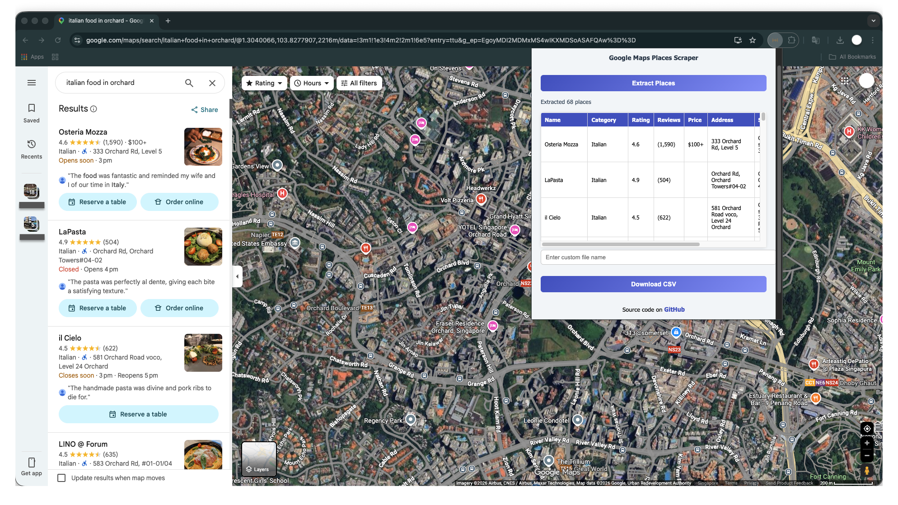

# Google Maps Detailed Scraping

A detailed scraping system for Google Maps, designed with a **2-level approach**:

1. **Chrome Extension** – Collect place listings quickly from Google Maps search results.  
2. **Selenium Script** – Extract detailed information from each place for deeper analysis.

This design ensures both efficiency and thorough data collection.

---

## Preview



---

## Features

* Extract key information for each place:
    * Name
    * Category
    * Rating & Reviews
    * Price range
    * Address
    * Business status
    * Images
    * URL
* Export results to CSV
* Custom file naming supported
* Modern, clean Chrome extension interface
* Scalable Selenium pipeline for detailed scraping

---

## Installation

### 1. Clone the repository

```
git clone https://github.com/ReinerJasin/google_maps_detailed_scraping.git
cd google_maps_detailed_scraping
```

### 2. Load Chrome Extension

1. Open **Google Chrome** and go to: `chrome://extensions/`
2. Enable **Developer Mode** (top right corner)
3. Click **Load unpacked** and select the repository folder
4. The extension will now appear in your Chrome toolbar

### 3. Optional: Pin the extension

* Click the puzzle icon in Chrome and pin the extension for easier access

---

## Usage

1. Open Google Maps: `https://www.google.com/maps`
2. Search for a location or category (e.g., "restaurants in Singapore")
3. Scroll the results to load more places
4. Click the extension and press `Extract Places`
5. Wait until extraction completes
6. Enter a custom filename if desired, then click `Download CSV`

---

## Detailed Scraping (Selenium)

> The Selenium-based detailed scraping module is currently under development and may not yet be released.

* After collecting URLs with the extension, Selenium can visit each place page to extract:
    * Detailed reviews
    * Opening hours
    * Additional metadata

This allows more in-depth analysis beyond the initial extraction.

---

## Planned Features

* Development of the detailed Selenium scraper
* Automatic adjustment for different place types (restaurants, hotels, and others) where Google Maps presents information in varying formats

---

## Notes

* This code was created with the assistance of AI models (ChatGPT) and may not be fully accurate out of the box.
* All functionality has been curated and verified to ensure correct results for its intended use.
* Google Maps interface may change, requiring updates to selectors.
* Use the tool responsibly and ethically, keeping within usage limits.

---

## Contributing

* Contributions are welcome to improve accuracy, performance, or the user interface.
* Fork the repository and submit a pull request with proposed changes.

---

## Acknowledgements

* This project was inspired by [itsmikepowers' Google Maps Easy Scrape](https://github.com/itsmikepowers/google-maps-easy-scrape)

---

## Author

### Reiner Anggriawan Jasin
* LinkedIn - [Reiner Jasin](https://www.linkedin.com/in/reinerjasin/)
* Personal website - [reinerjasin.site](https://reinerjasin.site/)

---

## License

This project is for educational and personal use. Use responsibly.